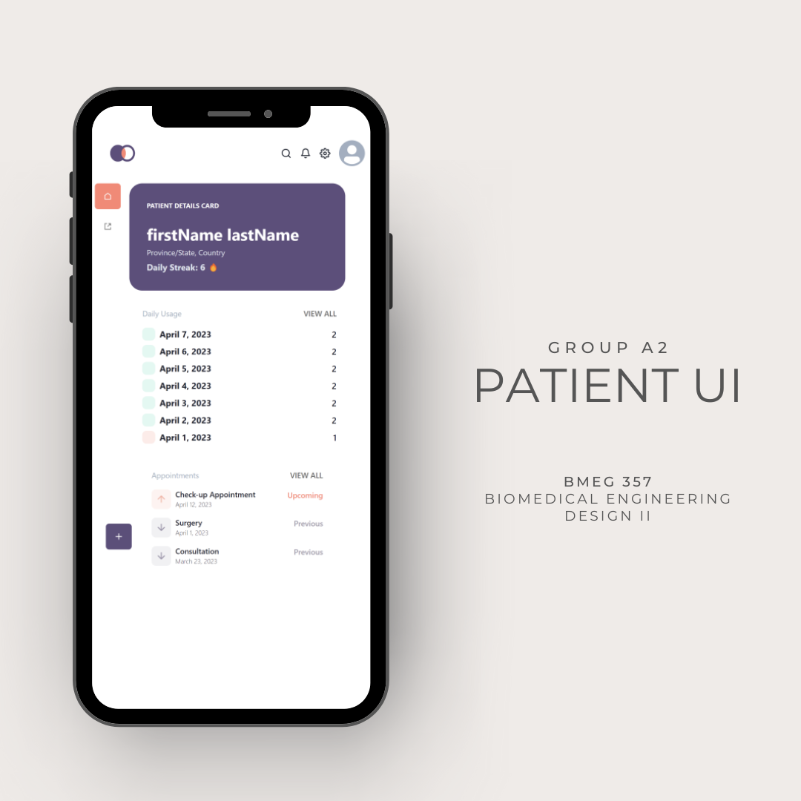
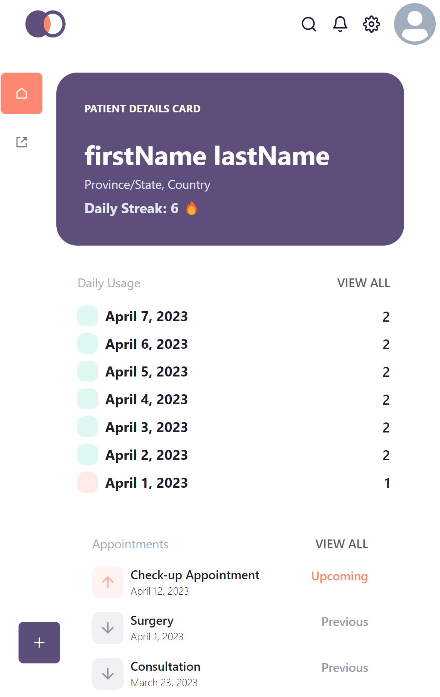

# BMEG-357-Patient-UI

## *BMEG 357 Biomedical Engineering Design II*

*Group A2: Yasir Ahmed, Alice Hong, Faize Rahman, Iddo Sadeh, Jaiden Siu, Ella Tate*

This repository holds the front-end user-facing software that the patient would interact with on the daily basis. It features a clean and user-friendly interface displaying a streaks feature for user gamification, encouraging users to comply to their medication and dosage. It also features a usage tracking meant for the user to document their dosages and a treatments section to remind patients of their upcoming appointments.

The development of this prototype utilizes React.js which is a free and open-source front-end JavaScript library used to build user interfaces in components. Languages that this user interface was implemented with includes HTML, CSS, and JavaScript. This project was developed in VS Code with Git version control and Yarn package manager to manage the software hosted on GitHub.

